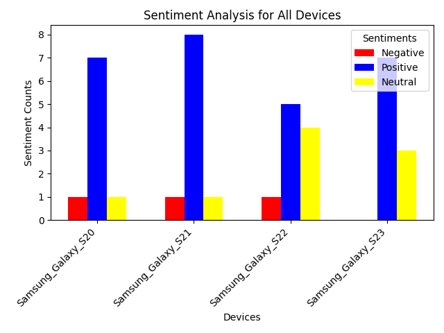

# Sentiment Analysis Pipeline

## Overview
This project automates the process of sentiment analysis for customer reviews scraped from eBay for different Samsung Galaxy devices. The pipeline includes web scraping, sentiment analysis using a local language model (Phi-3), and data visualization using Matplotlib. The goal is to classify reviews as **positive**, **negative**, or **neutral** and summarize the results in a single bar chart.

---

## Features
- **Web Scraping**: Automatically extracts product reviews for specified devices from eBay.
- **Sentiment Analysis**: Uses the Phi-3 model to classify reviews as positive, negative, or neutral.
- **Visualization**: Generates a bar chart summarizing the sentiments for all devices in a single plot.

---
## Prerequisites

- Python 3
- Ollama installed and running locally.
- Phi-3 Mini model (`phi3`) pulled via Ollama.
- Beautiful soup installed

---

## Project Files
- **input.txt**: Contains device names and eBay URLs for scraping reviews.
- **review_scraper.py**: Scrapes reviews from eBay.
- **sentiment_analyzer.py**: Analyzes reviews using the Phi-3 model.
- **sentiment_pipeline.py**: Integrates scraping and analysis.
- **plot_sentiments.py**: Generates the sentiment analysis bar chart.
- **output/**: Stores the generated sentiment files and plot.

---

## Installation

### 1. Clone the Repository
Clone the repository to your local machine:
```bash
git clone <repository_url>
cd project/
```

### 2: Install and Set Up Ollama

1. Download and install Ollama from the [official website](https://ollama.com).

2. Start the Ollama server on an separate terminal:
    ```bash
    ollama serve
    ```

3. Pull the Phi-3 Mini model to ensure it's available locally:
    ```bash
    ollama pull phi3
    ```

4. You can check list of all installed models on your system using the following command:
    ```bash
    ollama list
    ```
5. TO get help related ollama use:
    ```bash
    ollama --help
    ```
### 3. Install Dependencies
Install the required Python packages:
```bash
pip install -r requirements.txt
```

### Usage
**1. Configure Input**- 
Edit the input.txt file to include the URLs of the devices and their respective review pages. Example format:
#Samsung_Galaxy_S20
https://www.ebay.com/urw/Samsung-Galaxy-S20-Ultra-5G-128-GB-Black-Unlocked-/product-reviews/10041848098?pgn=1

#Samsung_Galaxy_S21
https://www.ebay.com/urw/Samsung-Galaxy-S21-Ultra-5G-512-GB-Black-Unlocked-/product-reviews/13043687483?pgn=1

#Samsung_Galaxy_S22
https://www.ebay.com/urw/Samsung-Galaxy-S22-Ultra-512-GB-Black-Unlocked-/product-reviews/13052280684?pgn=1

#Samsung_Galaxy_S23
https://www.ebay.com/urw/Samsung-Galaxy-S23-Ultra-256-GB-Black-Unlocked-/product-reviews/23059054247?pgn=1

**2. Serve Ollama**-
Make sure you have ollama running in separate teminal by using the command :
```bash
ollama serve
```
**3. Run the Pipeline**-
Run the following command to execute the pipeline:
```bash
python3 main.py
```
**Output**-
Sentiment Files: Sentiment classifications for each device are saved in output/ as <device_name>_sentiments.txt.
Combined Plot: A bar chart summarizing the sentiment analysis for all devices is saved as output/sentiment_analysis_combined_plot.png.

### Example

**Input**-
Sample reviews for Samsung_Galaxy_S20:

"Amazing phone with excellent performance!"
"Battery life is disappointing."
"Average phone for the price."

**Output**-
Sentiment counts:
Positive: 1
Negative: 1
Neutral: 1

Bar chart: The bar chart groups sentiments (positive, negative, and neutral) for all devices with the following colors:
Red: Negative
Blue: Positive
Yellow: Neutral

### Visualization

The bar chart generated (sentiment_analysis_combined_plot.png) looks like this:


The bar chart above summarizes the sentiment analysis results for customer reviews of four Samsung Galaxy devices:

**Devices**: The x-axis represents the Samsung Galaxy devices (S20, S21, S22, S23).
**Sentiment Counts**: The y-axis shows the number of reviews classified into three categories:
Red (Negative): Reviews that express dissatisfaction.
Blue (Positive): Reviews that highlight satisfaction.
Yellow (Neutral): Reviews with a balanced or indifferent tone.
Each device's bar group allows a direct comparison of positive, negative, and neutral sentiments, helping identify how customers perceive each device. 
**For example:**
Samsung_Galaxy_S21 shows a high number of positive reviews compared to other devices.
Samsung_Galaxy_S22 has relatively balanced neutral and positive sentiments.


### Tests
This project includes automated test cases written using pytest to ensure the correctness of each module in the pipeline.

## Running the Tests
**1 . Install pytest:** Install pytest if not already installed:
```bash
pip install pytest
```
**2. Run the Tests:**Execute all tests by running:
```bash
pytest
```
**3. View Results:**The output will indicate whether each test passed or failed, along with any relevant error messages.

## Description of Tests
## test_analyzer.py-

Module: SentimentAnalyzer
Purpose: Validates sentiment classification for predefined comments.
Checks:Correct number of sentiments returned, Sentiments are classified as positive, neutral, or negative.

## test_pipeline.py
Module: SentimentPipeline
Purpose: Tests integration of scraping and sentiment analysis.
Checks: Correct sentiment classification for mock reviews, Sentiment output files are correctly generated.

## test_plot.py
Module: plot_sentiments_combined
Purpose: Ensures the sentiment bar chart is generated correctly.
Checks: Bar chart file is saved in the output/ directory.

## test_scraper.py
Module: ReviewScraper
Purpose: Validates the review scraping functionality.
Checks: Fetched reviews match expected mock data.

**If any test fails, pytest will display a detailed error log to help debug the issue.**